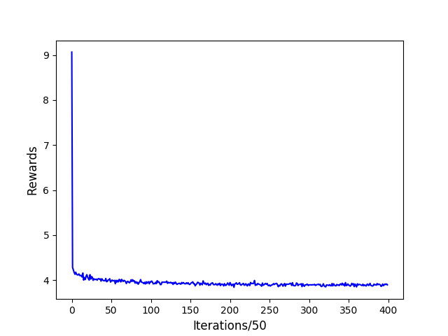
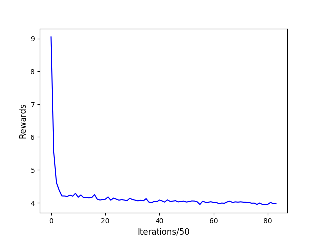

# TSP-using-Policy-Gradient

## Instructions to run

To run TSP using policy gradient,

```python Neural_Reinforce.py```

To run our entropy regularization experiments,

```python Entropy_Reinforce.py```

To run our 2-opt heuristic baseline experiment,

```python Heuristic_Reinforce.py```

## Plots

To make plots from rewards run,

```python plots/plot_graph.py```



Reward graph for entropy regularization TSP20 experiment



Reward graph for heuristic baseline TSP20 experiment


## References

We took the boilerplate code from [here](https://github.com/MichelDeudon/encode-attend-navigate)

@inproceedings{Deudon2018LearningHF,
  title={Learning Heuristics for the TSP by Policy Gradient},
  author={Michel Deudon and Pierre Cournut and Alexandre Lacoste and Yossiri Adulyasak and Louis-Martin Rousseau},
  booktitle={CPAIOR},
  year={2018}
}
